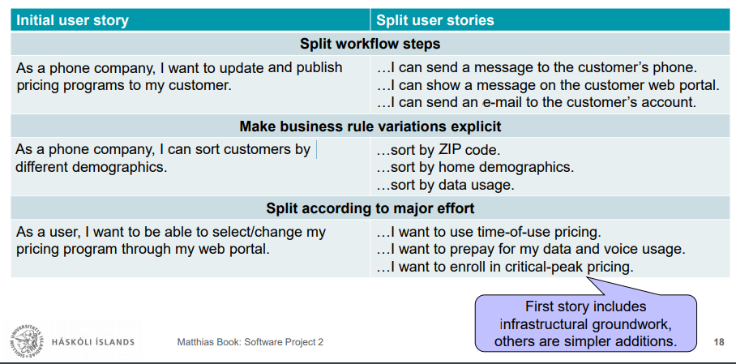

# HBV602 - Notes

#### Agile Process, Requirements, Estimation.

#### Agile Practices - A Critical Review

****

## Requirements in Agile Projects 

### Valid Requirements Are the Key to Project Success

* The majority of project failures is due to incorrectly addressed requirements.  
* Managing requirements is more challenging than technical execution of project.  
* We can’t rely on the customers to "just tell us" their requirements.

Agile purist approach: "Let's not attempt to define precise requirements then, but figure things out along the way."
* Agile approaches do not make requirements work easier!
* Instead interleave the requirements work more tightly with other activities and allow the team to make course corrections along the way.

### Defining and Communicating the Project Vision

In agile approaches, we strive to prevent
  * overinvesting effort in things we are unlikely to understand very well initially anyway
  * binding resources too early on a fixed set of commitments that we may wish to change later
* No explicit project definition or Software Requirements Specification is prepared

Need another way to communicate project vision to agile development team, i.e. to make developers aware of strategic intent as overall frame of reference:
* Why are we building this product / system / application?
* What problem will it solve?
* What features and benefits will it provide? For whom?
* What platforms, standards, applications etc. will it support?
* What system landscape will it be integrated with?
  
An explicit document (can be quite concise) is still the best way to express this.

### Defining and Communicating the Project Vision: Suitable Documents

#### Vision Document

* RUP Vision Document works well at the start of agile projects too (customize as needed)
* Encourages consideration of most relevant business and scope considerations

#### Product Data Sheet 

* A two-page "flyer" highlighting product's key characteristics
* Not just marketing-speak – describe product concisely and precisely
* Not intended for actual publication, but to encourage team to frame vision of final product

#### Hypothetical Press Release

* Drafting hypothetical press release for the future release day can help teams to think the project through in user’s and management’s terms, and clearly articulate its benefits.
* Need to tell complex story in simple, concise way – opportunity to involve marketing dept 
and entice internal stakeholders

#### Feature Backlog with Briefing

* If product managers or other responsible stakeholders have a clear enough idea of the project to begin elaborating a preliminary backlog, this can serve as communication basis
* Have dedicated vision workshop where preliminary backlog is introduced to team, together with discussion of the project motivation
* Preliminary backlog can serve as starting point for effort estimation and prioritization

### Needs, Features and Requirements

The project vision (in whichever form) focuses on features
* i.e. capabilities provided by the system that fulfill one or more stakeholder needs
* Described in concise key phrases, e.g. "spell checking as you type"

Features bridge gap between the values that the system shall support (needs)
and the exact form that this support shall take (software requirements)
* Guideline: Any system (no matter how complex) can be described by < 15-25 key features
  * If you think you need more features, you’re thinking about them on a too detailed level

#### Guideline for moving between abstraction levels:
1. First think and talk about **features** as an intuitive starting point for a product scope discussion
2. Then talk about **needs** to broaden scope and make sure you didn’t miss anything
3. Then think and talk about **requirements** to go into more detail about how features will be supported

### Epics 

Another (optional!) abstraction level on top of features
* In large projects, a common theme for several features (e.g. "Personalization")
* In large organizations, a driver for a particular IT project (e.g. "Move CRM to cloud")
* Use only if you feel you need to group your features into larger categories

#### Examples

##### Epic:
* In addition to physical store, sell goods also in an online shop.

##### Needs:
* Payment in the online shop needs to be effortless, so customers have 
no reason to change their mind and bail out of a purchase at the last second
* Customers need to trust the shop so they will return to it to buy more.
* The shopkeeper needs to minimize their risk of being defrauded by customers in order to remain profitable.

##### Features regarding the need for "effortless payment":
* Payment by credit card
* Payment by PayPal
* Payment by invoice
* Payment by voucher

##### Features regarding the need for "trust in the shop":
* Notification in case of shipping delays
* Refund for returned goods
* Secure transmission of payment data
* Clear display of prices, terms and conditions

##### Requirements for feature "Payment by credit card":

*User Stories describe requirements.*

As a customer,
* I can pay by credit card for my purchase so I don’t need to remember making a payment before/after receiving the goods.
* I can let the shop store my credit card information so I can pay more conveniently for subsequent purchases.
* I can delete stored credit card information from the shop’s records and thus remain in control of my personal data.
* I am informed about the success or failure of each credit card transaction so I know if my payment went through.

As a shopkeeper,
* I want to accept payments by credit card so I can serve domestic and international customers using the same processes.
* I can recognize invalid or blocked credit card numbers immediately so I don’t need to spend fees on transactions that are bound to fail.
* I want to receive confirmation of payment before shipping any goods, in order to reduce the risk of fraud.
* I can reverse credit card payments in case of returns in order to keep my accounting simple.

##### Task Example

Define acceptance test

### User Stories

In agile projects, requirements are typically expressed as user stories:
* "As a [role], I can [activity] so that [business value]."

#### User stories serve as a common communication format
* short, easy to read (=> HBV401G, Lecture 3)
* not precise requirements specifications, but expressions of interest
* understandable by and valuable to customers
* understandable by and testable by developers
* organized in lists that can be flexibly rearranged, rather than large documents

Don’t get too fixated on the above format though
* It should encourage you to think about target groups, requirements and rationales
* But if it gets cumbersome to express sth. this way, write it whichever way yields most clarity
* e.g. "log in to my customer portal", "see my daily data usage", "check my phone bill"

User stories represent "one unit of functionality"
* for all purposes of planning and measuring progress (→ HBV401G, Lectures 4 & 5)
* small enough that the team can build about half a dozen in an iteration
* small enough that one can be implemented in a period of days to weeks
* Not detailed at the outset of the project but elaborated just-in-time
* This means: You clarify them with the client before you start estimating and coding them.
* This does not mean: You interpret them your way and then ask the customer if you guessed right.

Besides "requirements" stories, a backlog can also contain other work items
* e.g. refactoring, bug fixes, support, maintenance, tooling, infrastructure work
* not phrased like a user story, but sized and treated as such for planning purposes

#### Refining User Stories

Formats for expressing epics/needs, features, requirements are somewhat fluid
* Prefer key phrases for the more high-level abstraction layers
* Prefer user stories (or even use cases) for the lower abstraction layers
* Most importantly: Write precisely and appropriately for the given abstraction layer

Initial versions of user stories may be too broad
* Some may actually not describe requirements, but features or even epics
  * Rephrase them as such, and consider what requirements would address that feature/epic.
  * Helps to structure requirements, and identify groups of requirements that are not sufficiently explored yet
* Some may describe requirements too broadly
  * Split them up into several, more precise user stories
  * Helps to refine requirements and obtain more clearly defined, independently implementable functionalities
* Stepwise refinement of user stories is natural, and a good thing
* Great opportunity for focused discussion with customer and learning about the business domain

#### Patterns for Splitting User Stories

### Dealing with Uncertainty in Spikes

"Spikes" are special backlog items aimed at reducing risk and uncertainty, e.g.
* Performing basic research, familiarizing team with new technology or business domain
* Analyzing a complex user story to see how it can be broken down into estimable pieces
* Prototyping to gain confidence in a technology and make more informed estimate

Technical spikes aim to research technical approaches, e.g.
* Evaluate implementation technologies, make build-or-by decisions
* Evaluate a user story’s performance or load impact
* Gain confidence with an approach before committing to an estimate

Functional spikes aim to understand how users will work with the system, e.g.
* Prototype interface through mock-ups, wireframes, storyboards etc.
* Get feedback from stakeholders

##### Spikes do not directly deliver user value, so use sparingly and with caution!

Guidelines:
* Spikes are treated like other backlog items, i.e. estimated and sized to fit in an iteration
* Spikes do not produce working code, but information, e.g. a prototype or basis for decision
  * Spike results should still be concrete and demonstrable (helps to justify effort to stakeholders)
* Spikes should be the exception, not the rule
  * Each user story has inherent uncertainty, and will therefore involve some spike-like research
  * Explicit spike backlog items should be reserved for larger, more critical uncertainties
* Spike should not be planned in the same iteration as the user stories relying on its outcome
  * Otherwise, the planning of the user story cannot benefit from the knowledge gained in the spike

### User Stories Are Just the Tip of the Requirements Iceberg

* Even after refining user stories, you may find they still feel quite open-ended.
  * This is by design, since agile approaches deliberately eschew detailed requirements specs.
* You still need a more precise idea of user stories’ intention to implement them
* The required knowledge can take many shapes:
  * Knowledge from conversations with stakeholders
  * Attachments (e.g. examples, models, prototypes, use cases, data etc.)
  * Acceptance criteria (conditions of satisfaction placed on system)
  * Tasks (steps to be taken to ensure that acceptance criteria are satisfied)

### Acceptance Criteria

* Acceptance criteria are conditions of satisfaction being placed on the system.
  * "Based on which criteria can the customer and supplier agree that this user story has been implemented satisfactorily?"
* Acceptance criteria are not functional or unit tests, but are a first step towards making user stories evaluable against concrete criteria.
  * In effect, they are yet one more detailed level of the user story’s definition
    * Describing the solution in business terms
* Example user story:
  * As a consumer, I want to be able to see my daily energy usage so that I can lower my
consumption and cost.
* Example acceptance criteria:
  * Read deciwatt meter data every 10 seconds and display on portal in 15-minute increments.
  * Read kilowatt meter for new data as available and display on the portal every hour.

### Issues with User Stories

* User stories don’t give developers a context to work from
  * When is the user doing this? What is the context of the operation? What is their larger goal?
* User stories don’t give any sense of scope or completeness
  * How "deep" is a user story? What exceptions lurk inside? What’s outside these spotlights?
* User stories don’t provide a mechanism for looking ahead at upcoming work
  * Hard to foresee main and alternate scenarios; extensions usually recognized mid-iteration
* A list of backlog items is easy to comprehend, manage and prioritize, but inadequate to provide the context required to design larger systems.

### Use Cases 

#### Benefits of Use Cases

* A UC’s main success scenario states exactly what the system will and will not do
  * Provides context for each requirement, and agreement on scope between biz and tech side
* A UC’s alternate scenarios answer the many tricky, detailed business questions
that no business person initially thinks of but every developer soon runs into:
  * What are we supposed to do in this special case? What if that goes wrong in the process?
* A UC’s list of goals provides a summary of the system’s benefits & added value
  * Helpful for initial prioritizing, team allocation and scheduling
* A UC’s extension conditions highlight business and technical complexity drivers
  * These would otherwise surface while a requirement is worked on, and delay it unforeseeably
* Full set of UCs shows that developers have considered each user’s needs, each business goal and variant.
  * Gives customer and team more confidence that estimates and schedules are realistic.

#### Capturing Use Cases

1. Identify and describe the actors
   * Who uses the system?
   * Who gets information from this system?
   * Who provides information to the system?
   * Where is the system used?
   * Who supports and maintains the system?
   * What other systems or devices use this system?
2. Identify the use cases
   * What will the actor use the system for?
   * Will the actor create, store, change, remove, or read data in the system?
   * Will the actor need to inform the system about external events or changes?
   * Will the actor need to be informed about certain occurrences in the system?
3. Identify the actor and use case relationships
   * Which actor initiates the use case?
   * Which actors are participating in the use case?
4. Outline the flow of the use cases
   * Basic flow (main success scenario)
     * What actor’s event starts the use case?
     * How does the use case end?
     * How does the use case repeat some behavior?
   * Alternate flows (alternate scenarios)
     * What else can the actor do?
     * How will the actor react to optional situations?
     * What variants might happen?
     * What exceptions to the usual behavior may occur?
5. Refine the use cases
   * What are alternate flows, including unusual exception conditions?
   * What preconditions must be satisfied before a use case can start?
   * What exit conditions will the use case leave behind?
     * Success guarantee (state after successful execution)
     * Minimum guarantee (state after unsuccessful execution)

* Use cases can be useful "inside" and "outside" user stories
  * **"inside"**: A use case is attached to a particular user story,
  in order to specify how exactly the interaction demanded by the story shall play out
  * **"outside"**: A use case describes a complex interactive feature,
  whose realization will be broken into several user stories for project planning purposes
* Guidelines: When applying use cases in agile projects,
  * Keep them lightweight, i.e. no design details, GUI specs etc.
  * Don’t treat them like fixed requirements
    * Like user stories, they just state intended system behavior
  * Model them informally, and don’t worry too much about maintaining them
    * They are tools to help you understand the requirements, not to document them
* Use cases are a proven tool to think through complex system requirements
  * Highly recommended to use them independently of the chosen software process model

### Tasks

Once a backlog item (user story or other work item) is sufficiently understood in terms of the requirements it poses  
...it’s time to consider what needs to be done to implement those requirements
* i.e. which concrete activities team members need to perform to realize the backlog item
* Def.: A task is a small unit of work that is necessary for the completion of a backlog item.

This also is a form of refinement of the user story, but while 
* acceptance criteria refine the user story in business terms (product/user view), 
* tasks refine it in technical, operational terms (project/developer view)

Tasks help the team to understand what needs to be done
* most precise basis for estimating efforts
* interface between analysis/design and construction/controlling work in each iteration

User story:
* Select photo for upload

Tasks for story:
* Define acceptance test
* Code story
* Code acceptance test
* Get test to pass
* Document feature in user help

#### Summary: Agile Requirements Engineering

* Start by brainstorming on **features**
* Take a step back and consider **needs**, potentially **epics**
* Take a closer look and consider **requirements** (typ. in user story format)
* Schedule **spikes** to resolve uncertainties
* Refine **user stories**
  * Discuss with customer
  * Elaborate and/or split
  * Work out **use cases** to understand particularly complex scenarios
* Define **acceptance criteria**
* Define **tasks** to be performed in order to satisfy acceptance criteria
* **Prioritize** requirements, **estimate** efforts, **plan** iterations

#### Reflection: Requirements Engineering in Agile vs. Plan-driven Projects

**Similarities** between agile and plan-driven requirements engineering:
* Expect to spend just as much time on requirements work in either process
  * This is natural: Impossible to circumvent the need and effort of understanding the business domain well enough to implement the system correctly
* Requires a lot of learning, and critical reflection of one’s own knowledge and assumptions
* Requires close collaboration with the customer

The **differences** are that agile requirements engineering...
  * ... sees written requirements as starting points of clarification, rather than endpoints
  * ... permeates the whole project, rather than occurring in explicitly planned phases
  * ... takes many forms (user stories, discussions), rather than materializing in one document

**Refactoring is not an efficient alternative to diligent requirements work!**
* Refactor mostly to integrate new features into existing "minimum viable" code (pragmatic)...
* ... but don’t keep refactoring things just because you didn’t think them through (expensive)

## Software Estimation

### Accurate Estimates Are Based on Precise Requirements

A seemingly trivial requirement:
* Users must enter a valid phone number with their order.

But we need to understand:
* This is not just about entering, but about validating a number using some “phone number checker (PNC)”
* If the customer wants a PNC, will he want the version we can build in 2 hours, 2 days, or 2 weeks?
* If we implement the cheap version of the PNC, will the customer later want the expensive version after all?
* Can we use an off-the-shelf PNC, or are there design constraints that require us to develop our own?
* Do the PNC and the Address Checker need to interact? How long will it take to integrate them?
* How will the PNC be designed?
* How long will it take to code the PNC?
* What will the quality level of the PNC be?
* How long will it take to debug and correct mistakes made in the PNC implementation

Each of the last four can introduce a factor 10 of difference in complexity, quality, time etc.

### Cone of Uncertainty

 A measure for the maximum possible estimation accuracy over the course of a project
* Your cone may be wider
* i.e. your accuracy
may be worse!

The cone does not narrow by itself
* Continuous active work is required to eliminate sources of uncertainty in the project.

### Diseconomies of Scale

In software engineering, we have to deal with a diseconomy of scale:  
“The larger a system we build, the higher the cost of building each part.”

Effort does not scale linearly with project size, but exponentially.

### Difficulties in Software Estimation

* Caution when interpreting management requests
  * Determine whether you are expected to estimate, or figure out how to hit a target
* Caution when preparing estimates
  * Hard to quantify the subject
  * Lots of confounding factors
  * Temptation to tweak the estimate
* Caution when letting management interpret your estimates
  * Your estimates may be understood as precise commitments

### Estimates as Probability Statements

* Single point estimate: Assumes that estimate will accurately predict result (orange, poor)
* Bell curve: Disregards limits of how efficiently a project team can complete work (blue, inaccurate)
* **Realistic curve**: There’s a limit to how well a project can go, but not how bad (green)

* **Target**: fixed value (deadline, budget etc.) determined by external factors
* **Estimate**: preliminary prediction of a future value/interval
* **Commitment**: Intention of reaching a certain future value
* **Plan**: Agreement of steps to achieve the commitment

Some project events make (the foundations of) prior estimates obsolete. 

### The Purpose of Software Estimation

* The aim of effort estimates is not to predict the project result,
but to **judge whether the project target is sufficiently realistic**
to be **achievable through corresponding project management**.
  * Estimates do not need to be extremely precise, as long as they are **useful**.
* Experience: If the initial target and the initial estimate are within ~20% of each
other, the project manager will have enough maneuvering room (in terms of
features, schedule, staffing etc.) to meet the project’s business goals.
* If the gap between target and estimate is larger, it is very unlikely the project can
be completed successfully.
  * Bring target into better alignment with reality before the project has a chance of success.
  * **RESIST TEMPTATION / PRESSURE** to align estimate better with target!
    * Your first estimate is rough but honest.
    * Revisions not based on additional data are just kidding yourself and endangering your project.

### Estimation Approaches

#### When to use A1 or A2

* Use projection from counts, e.g. average effort per [item] (A)
  * WHEN: Early stages of a project
  * WHY: To get an initial rough idea of the overall size, effort and schedule of the project
  * BASIS: Reasonably complete overview of requirements, comparable historic data
  * ACCURACY: Highly dependent on accuracy of data, will be deprecated by later fluctuations
  * REFINEMENT: Use more precise approaches for product / sprint backlog estimates (B, C)

* Example use scenario:
  * Getting an idea of whether you can still complete a user story before end of sprint.

#### A1) Projection from Counts

1. Find a suitable type of item to count
* Highly correlated with size of software you’re estimating
* Available early in development cycle
* Statistically meaningful number of items available (>20)
  * If we are talking about less, the individual differences between these items become too dominant
* Countable with minimal effort
* Historical averages based on comparable parameters(!) available
  * Similar product, similar team, similar technology, similar complexity...
2. Count items of interest
3. Calculate effort from item counts, based on average effort per item

##### Countable Items for Projecting Estimates

* Marketing requirements
* Engineering requirements
* Features
* Use cases
* User stories
* Function points
* Change requests
* Web pages
* Reports
* Dialog boxes
* Database tables
* Classes
* Defects found
* Configuration settings
* Lines of code already written
* Test cases already written

**Projection**: Multiply counted items with average effort per item observed in historical projects of similar kind.

E.g. 
* For the last 250 defects we fixed, we needed 2 hours per defect on average.  
* 400 defects are currently open in our project.
* We need approximately 400*2 = 800 hours.

#### A2) Function Points (FP)

* Synthetic measure of software size assigned to counts of various types of items:
* **External inputs**
  * Screens, forms, dialog boxes, control signals through which an end user or other system adds, deletes, or changes our system’s data
* **External outputs**
  * Screens, reports, graphs, control signals that our system generates for use by an end user or other system.
* **Internal logical files**
  * Major logical groups of end-user data or control information completely controlled by our system, e.g. a single flat file or a single table in a database
* **External interface files**
  * Files controlled by other systems with which our system interacts; this includes each major logical group of data or control information entering or leaving our system

Each system characteristic is classified by complexity (low / medium / high)
and assigned an according number of function points:

| System Characteristic | Low | Medium | High |
| :-- | :--: | :--: | :--: |
| External inputs | 3 | 4 | 6 |
| External outputs | 4 | 5 | 7 |
| Internal logical files | 4 | 10 | 15 |
| External interface files | 5 | 7 | 10 |

* FPs are an abstract, relative measure of complexity, not absolute size/time/effort
* Formulas exist to translate FPs into lines of code, based on industry experience
  * e.g. in Java, 1 FP requires at least 40, typically 55, at most 80 lines of code
* More useful: Use organizational experience to translate FP to expected effort

##### Lines of Code (LOC)

###### *Interesting to consider, but recommended to avoid in practice.*

Advantages

* Data easily collected and evaluated by tools
* Lots of historical data exists
* Effort per line of code is roughly constant across languages
  * (Effect per line of code obviously is not!)
* Most convertible “currency” between projects
  * But make sure projects are comparable to draw meaningful conclusions!

Disadvantages

* LOC don’t reflect
  * Diseconomies of scale in software development effort
  * Difference in programmer productivity
  * Difference in expressiveness of programming languages
* Using LOC for estimating non-coding work (requirements, design etc.) is counterintuitive
* Which Lines of Code to count?

##### Estimation vs. Commitment

* In software projects, people will assume that your estimates can be directly translated into commitments.
* Your estimate is much less reliable than you think, but other people even think it’s much more reliable!
  * Carefully manage expectations and be clear about your confidence

#### B) Individual Expert Judgment

*See B1 and B2.*

* Let an expert (typically: developer) come up with an estimate for each feature
  * Caution: subjective, possibly based on non-transferable experience / incorrect assumptions
* Avoid developer single-point estimates
  * Usually, these reflect the developer’s subconscious best case assumption!
* Create three-point estimates: Best Case (BC), Most Likely Case (MLC), Worst Case (WC)
  * This will stimulate developers to think about full range of possible outcomes for each feature
* Calculate expected case from three-point estimates for each feature:
  * Basic PERT = (BC + 4MLC + WC)/6
  * Alt. PERT = (BC + 3MLC + 2WC)/6 ... *if team's MLC estimates tend to be too optimistic.*

#### When to use B1 or B2

* Use individual expert judgment, e.g. Three-Point Estimates (B)
  * WHEN: Early stages of a project
  * WHY: To obtain initial estimates for product backlog items, based on different scenarios
  * BASIS: Discussion of requirements, experts’ experience
  * ACCURACY: Higher than “gut feelings” that otherwise go into group expert estimate (C1)
  * REFINEMENT: Individual sprint planning (C2) will make more informed short-term estimates

* Example use scenario:
  * Establishing first release date (new project, new domain)

##### Checklist for Individual Estimates

* Is what’s being estimated clearly defined?
* Does the estimate include all the kinds of work needed to complete the task?
* Does the estimate include all the functionality areas needed to complete the task?
* Is the estimate broken down into enough detail to expose hidden work?
* Did you look at documented facts from past work or estimate purely from memory?
* Is the estimate approved by the person who will actually do the work?
* Is the assumed productivity similar to what has been achieved on similar assignments?
* Does the estimate include a Best Case, Worst Case, and Most Likely Case?
* Is the Worst Case really the worst case? Does it need to be made even worse?
* Is the Expected Case computed appropriately from other cases?
* Are you aware of the assumptions that are underlying this estimate?
* Has the situation changed since the estimate was prepared?

##### Training Your Estimation Accuracy Over Time

To improve estimation accuracy:
* Compare actual results to estimated results
  * Calculate Magnitude of Relative Error (MRE) for each feature estimate:
  MRE = | (ActualResult – EstimatedResult) / ActualResult |
    * The average of your MREs per sprint should decrease over time
* Check if actual results were in range between best case and worst case
  * The percentage of actual results that are in this range should increase over time
* Check if 50% of expected cases were overrun and 50% of them were underrun
  * If not, your individual estimates tend to be too optimistic or too pessimistic
    * Work on improving your best, most-likely and worst-case estimation accuracy
* Try to understand
  * What went right and what went wrong
  * What you overlooked
  * How to avoid making those mistakes in the future

##### Dangers of Adding Up Best / Worst Case Estimates

* Adding up the individual estimates to obtain e.g. a “total best case” is pointless!
* Suppose the probability of achieving any one of the best cases is 25%.
* The probability of achieving any two of the best cases then is 25% * 25% = 6.25%.
* The probability of achieving the best case for 10 features is (25%)^10 = 0.000095%.
* **This makes achieving the “total best case” completely unrealistic!**

### B1) Computing Probability Ranges for <11 Individual Estimates

1. Calculate standard deviation of the estimate totals:  
`StandardDeviation = ( sum(WorstCaseEstimates) – sum(BestCaseEstimates)) / 6`
2. Decide how confident your estimate needs to be
3. Pick according factor from table, and calculate  
`PercentConfidentEstimate = ExpectedCase + Factor * StandardDeviation`

| Confid.  | 2% | 10% | 16% | 20% | 25% | 30% | 40% | 50% | 60% | 70% | 75% | 80% | 84% | 90% | 98% |
|:-:|:-:|:-:|:-:|:-:|:-:|:-:|:-:|:-:|:-:|:-:|:-:|:-:|:-:|:-:|:-:|:-:|
| Factor  | –2 | –1.28 | –1 | –0.84 | –0.67 | –0.52 | –0.25 | 0 | 0.25 | 0.52 | 0.67 | 0.84 | 1 | 1.28 | 2 |

Problem: Statistics of previous approach assume that 99.7% of actual results
fall into estimated range (between best and worse case).
* i.e. only 3 out of 1000 estimates could fall outside estimated range!

Obviously completely unrealistic
* Most people are actually about 30% sure when they think they are 90% sure
* With practice, about 70% can be achieved

For <11 estimated items, the impact of this error is negligible,
so we can still use the previous simple approach.

### B2) Computing Probability Ranges for >10 Individual Estimates

1. Check how many of your actual outcomes fall within your estimation range
2. Determine according divisor in table on the right
3. Calculate the variance of each individual estimate:  
`Variance = ((WorstCaseEstimate – BestCaseEstimate) / Divisor)^2`
1. Calculate total of the individual variances
2. Take the total’s square root to obtain the standard deviation
3. Continue with step 2 of previous approach

| % in range | 10% | 20% | 30% | 40% | 50% | 60% | 68% | 70% | 80% | 90% | 99.7% |
|:-:|:-:|:-:|:-:|:-:|:-:|:-:|:-:|:-:|:-:|:-:|:-:|
| Divisor | 0.25 | 0.51 | 0.77 | 1 | 1.4 | 1.7 | 2 | 2.1 | 2.6 | 3.3 | 6 |

### C1) Group Expert Judgment: Wideband Delphi

1. Delphi coordinator presents each estimator with specification, estimation form
2. Estimators prepare initial estimates for features individually.
3. Coordinator calls group meeting in which estimators discuss estimation issues.
4. Estimators give their individual estimates to coordinator anonymously.
5. Coordinator prepares summary of estimates and shows estimators.
6. Coordinator lets estimators discuss variations in estimates.
7. Estimators vote anonymously on whether to accept average or return to #3.

**Final estimate is a range created in discussion, average is expected case.**

#### When to use C1

* Use elaborate group expert judgment, e.g. Wideband Delphi (C1)
* WHEN: Early stages of a project
* WHY: To obtain initial estimates for product backlog items, based on prior experience
* BASIS: Discussion of requirements, experts’ experience
* ACCURACY: Reasonably high if experts have sufficient domain knowledge
* REFINEMENT: Individual sprint planning (C2) will make more informed short-term estimates

### C2) Group Expert Judgment: Planning Poker (Recap)

1. Place a user story in the middle of the table.
2. Everyone picks an estimate for the story from their hand and places the card face-down on the table.
3. Everyone turns their card over at the same time.
4. Note and discuss the spread of the estimates.
5. Decide on an estimate that the whole team can agree on.
* Not necessarily the average!

#### When to use C2

* Use pragmatic group expert judgment, e.g. Planning Poker (C2)
  * WHEN: Sprint planning meetings
  * WHY: To obtain detailed estimates for all sprint backlog items and commit to sprint contents
  * BASIS: Elaboration of and discussion of requirements, breakdown of tasks
  * ACCURACY: High w enough domain knowledge, performance experience, breakdown detail
  * REFINEMENT: Tracking velocity helps team to calibrate estimates in subsequent sprints

* Example use scenario:
  * Sprint planning

#### What to Estimate in Planning Poker?

Story Points
* Synthetic measure
* Only indicates relative complexity (and therefore relative effort) of user
stories, but does not directly translate into absolute effort
  * Translation into absolute effort is implicit
  as team executes sprint and achieves a certain velocity
* Estimate focuses on complexity and
is kept free of real-time considerations
  * more objective, but hard to communicate

Person-days
* Describes an actual property
  * Easier to handle by teams who are new to agile approach
  * easier to communicate to management
* Estimates may be politically biased
  * Developers may not dare to estimate high so as not to appear “slow”

Suggestion: Use story points, but have informal convention that 1 story point corresponds to 1 person-day.

### D) Qualitative Estimation: T-Shirt Sizing

* Chicken and egg problem in agile projects:
  * Team members shouldn’t spend effort on understanding / refining a feature’s requirements until they are reasonably sure it is actually going to be built
  * Management doesn’t want to decide on whether a feature shall be built until they have some idea of the required effort

* Solution:
  * Initially use a highly intuitive, relative, coarse and fast estimation scheme
  * Classify features by Business Value and Development Cost
  * using “t-shirt sizes” (small, medium, large, extra large) as categories
* E.g.

| Feature | Business Value | Development Cost |
|:-:|:-:|:-:|
| A | Large | Small |
| B | Small | Large |
| C | Large | Large |
|...|...|...|

#### Calculating Net Business Value Based on T-Shirt Sizes

* Discussion on which features to retain and which to cut is easier when feature list is sorted according to cost/benefit evaluation
* Use following matrix (or similar one of your own) to assign net business value:
* Sort features by resulting net business value
* Identify “definite yes” and “definite no” features, discuss others in more detail

#### When to use

* Use rough qualitative estimation, e.g. T-Shirt Sizing (D)
* WHEN: Initial stages of a project
* WHY: To make initial decisions on the general scope of project
* BASIS: General vision of project, high-level business and technology constraints
* ACCURACY: Quite reliable in definitive YES and NO areas, very fuzzy in the middle region
* REFINEMENT: Refine included features in product and sprint backlog discussions (B, C)

* Example use scenario:
  * Establishing a rough project scope

### Advantages of Precise Estimates

* Confirmation that project is on track
* Higher software quality due to reduced stress
* Better alignment with plans of other business units
* Higher financial safety
* Reference values for later projects
* More competent image of developer team
* Early risk indicators when target and estimate diverge
  * i.e. early chance to remedy the situation...
    * Changed project scope
    * More staff
    * Use of experts
    * Incremental deliverables
    * Decision against project
  * ... instead of ignoring/negotiating the estimate and accepting the risk of
    * Schedule or budget overruns
    * Forced functionality reductions

### Project Qualities Expected by Customers

* Every customer prefers a project that is (Iron Triangle)
  * on schedule (time)
  * within budget (cost)
  * fulfilling expectations (functionality / scope)
* If you need to compromise on any of these,
  * let the customer know early what to expect
  * and work on an acceptable solution together
* What customers value most is... **Predictability!**

### Practicing Estimation and Controlling Techniques

* Try to re-estimate your project based on a more refined list of user stories,  
using one of the methods presented above
  * Check how the results of different estimation methods compare
  * Gain experience with the estimation process
* Throughout the project, record your working hours so you can compare them to your estimates later
  * Gain experience with how long you need for certain tasks
  * Get a feeling for how your actual performance differs from your estimated performance
* Throughout the project, maintain a burndown chart recording your progress through the sprints
  * Gain experience with velocity tracking
  * Get a feeling for how much you can commit to, and what overhead you need to consider

## Agile Practices - A Critical Review

###### Bertrand Meyer: Agile! The Good, the Hype and the Ugly. Springer, 2014

*Meyer’s preceding critical review is not established "textbook" knowledge, but a contribution to an ongoing academic and professional discussion.*  
Some of his criticism will weigh differently depending on the type of project, the composition of the team, etc.*  
*It is provided here to spark and encourage your own critical thinking about the software engineering practices you have learned about.*

### "The Ugly"

* **Rejection of up-front tasks, particularly: no up-front requirements**
* **User stories as a replacement for abstract requirements**
* **Feature-based development and ignorance of dependencies**
* Tests as a replacement for specifications
* Test-driven development
* Embedded customer
* Coach and method keeper (e.g. Scrum Master) as a separate role
* Dismissal of traditional manager tasks
* **Dismissal of a priori architecture work**
* **Dismissal of a priori concern for extensibility**
* **Dismissal of a priori concern for reusability**
* Dismissal of auxiliary products and non-shippable artifacts

### "The Indifferent"

* Pair programming
* Open-space working arrangements
* **Self-organizing teams**
* **Maintaining a sustainable pace**
* Producing minimal functionality
* **Planning game, planning poker**
* **Cross-functional teams**

### "The Good"

* **Acceptance of change**
* **Frequent iterations**
* Emphasis on working code
* Tests as one of the key resources of the project
* Constant test regression analysis
* No branching
* Product (but not user stories!) **burndown chart**
* **Daily meeting**

### "The Brilliant"

* **Short iterations**
* **Closed-window rule**: *during a sprint, no one may add functionality*, which address *disruptive feature creep*.
* **Refactoring** (but not as a substitute for design)
* **Associating a test with every piece of functionality**
* **Continuous integration**

## More Actionable Agile Principles

Organizational Principles  
  1. Put the customer at the center
  2. Accept change
  3. Let the team self-organize
  4. Maintain a sustainable pace
  5. Produce minimal software
     1. Produce minimal functionality
     2. Produce only the product requested
     3. Develop only code and tests

Technical Principles
  1. Develop iteratively
     1. Produce frequent working iterations
     2. Freeze requirements during iterations
  2. Treat tests as a key resource
     1. Do not start any new development until all tests pass
     2. Test first
  3.  Express requirements through scenarios

