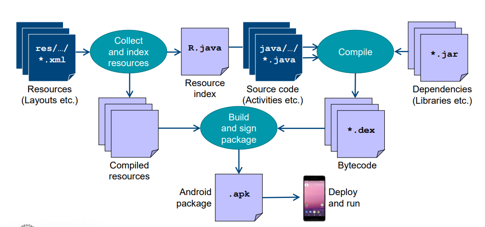
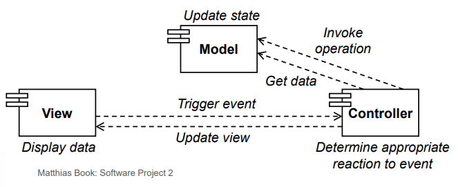
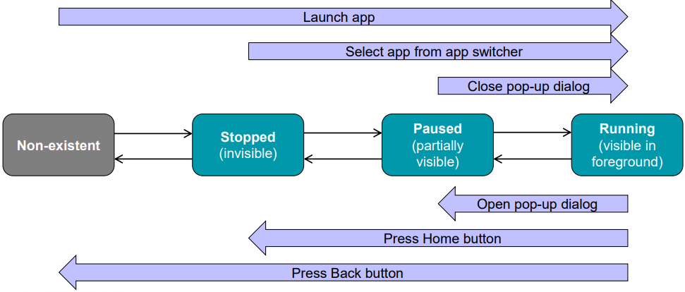
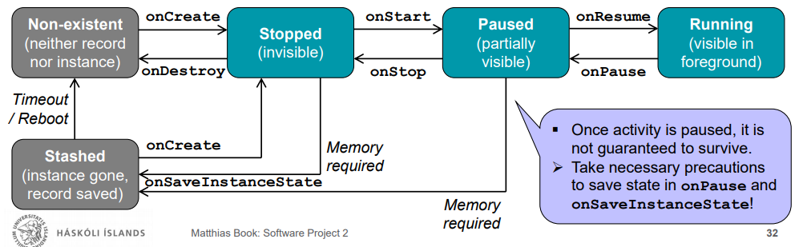
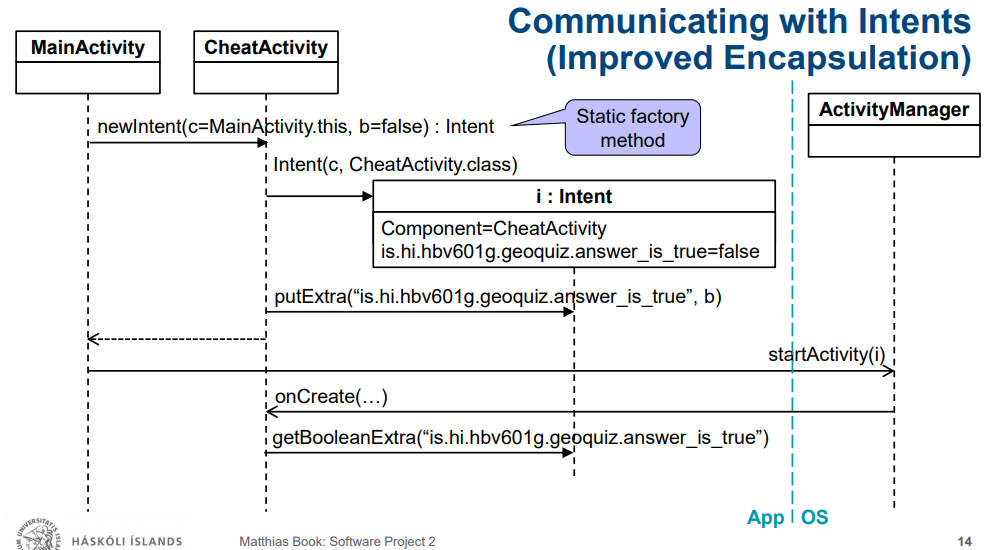

# HBV602 - Notes

#### Android Basics

****

## Android Basics

### Activities and Layouts

* An **activity** is responsible for managing user interaction  
with a screen of information, i.e. to implement a part of  
the functionality of your app.
* A **layout** defines a set of UI objects and their screen positions
* The activity `MainActivity` manages the UI
that the layout activity_main.xml defines.

### Widgets

* A **widget** is a user interface component, i.e. a **building block of a layout**.
  * Widgets can show text or graphics, interact with the user, or arrange other widgets on screen
* The widgets of each layout form a hierarchy of `View` objects (“view hierarchy”)
* Elements of the view hierarchy can be
  * visible UI elements
    * e.g. `TextViews`, `Buttons` etc.
* `ViewGroups` (i.e. widgets containing and arranging other widgets in particular ways)
  * e.g. `LinearLayout`, `FrameLayout`, `TableLayout`, `RelativeLayout`
  * e.g. `LinearLayout` places the contained widgets vertically or horizontally next to each other
* Attributes of the XML elements indicate how the widgets shall be configured.
* `text` attributes of widgets can contain
  * literal text
  * References to string resources
    * Strings are defined in a strings file
* `setContentView(R.layout.activity_main)` “inflates” the layout
  * i.e. parses the XML layout file and creates according Java objects for all widgets


### Resoucres

* A resource is any piece of an app that is not code
  * e.g. images, XML files etc.
* stored in subdirectories of `app/src/main/res`


### Quiz 3

* An **activity** manages the user’s interaction with the UI defined by a layout.
* A **layout** defines a set of **widgets** and their screen positions.
* A view hierarchy contains the **widgets** of one **layout**.
* The `setContentView` method of an **activity** inflates the given **layout**.
* Inflating a **layout** means creating Java objects for all **widgets** declared in it.
* A **resource** is any piece of an app that is not executable code.
* The auto-generated `R` class contains references to all **resources** and **widgets**
  defined in XML files under `app/res/`.

### Android Build Process




## The Model-View-Controller Pattern in Android Apps

* Model: Objects responsible for holding the app’s data and business logic
* View: Objects that know how to draw themselves on the screen and how to respond to user input
* Controller: Objects that respond to events triggered by views, invoke logic on  
  the model, and thus manage the data and control flow between model and view




## The Activity Lifecycle

* Activities may transition between three states during their lifecycle.

* To work optimally under the changed configuration, an activity may require  
  different resources (e.g. a different layout or different graphics)
  * To re-initialize the resources, the activity depends on onCreate being called again





* Call order: `onPause`, `onStop`, `onDestroy`, `onCreate`, `onStart`, `onResume`.

* Android provides a way to save and retrieve activity state at time of transitions:
  * `onSaveInstanceState(Bundle)` saves current instance state in an activity record
  * `onCreate(Bundle)` reconstitutes the activity’s state from the saved activity record
* An activity record is kept even if the activity instance is removed from memory
  * `onSaveInstanceState` : Method called by Android when activity becomes killable
    * Default implementation lets all view objects store their state in a Bundle  
      (a data structure mapping keys to values, typically primitive types).
    * We can extend the method to store additional data in the same Bundle
```java
if (savedInstanceState != null) {
  mCurrentIndex = savedInstanceState.getInt(KEY_INDEX, 0);
}
```

* `onCreate` is typically overridden to prepare the activity’s user interface:
  * Inflating widgets and putting them on screen (with setContentView)
  * Getting references to inflated widgets, in order to work with them later
  * Setting listeners on widgets to handle user interaction
  * Retrieving saved instance state
  * Connecting to external model data
* `onSaveInstanceState` is typically overridden to store small, transient items
* `onPause` is typically overridden for larger save/cleanup tasks upon loss of focus


## Communicating With Intents

* With Intents we can 
  * invoke another screen (i.e. activity) 
  * and pass information to it; 
  * then return to the previous activity 
  * and return information to it. 

* An activity communicates with the Android OS by exchanging intents.
* `Extras` are arbitrary data (key-value pairs) included with the intent.
* **Explicit** intents invoke activities in the same app, but **implicit** intents can invoke activities in other apps.
* To get a result back, invoke an activity with `startActivityForResult(Intent i, int requestCode)`.
* Android will call the `onActivityResultt(int requestCode, int resultCode, Intent data)`  
  event handler on the parent activity in order to send the result back to it:





