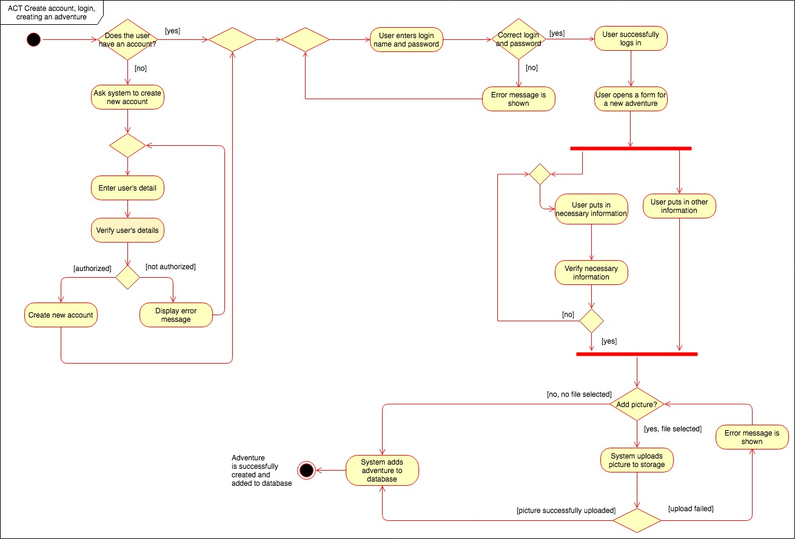
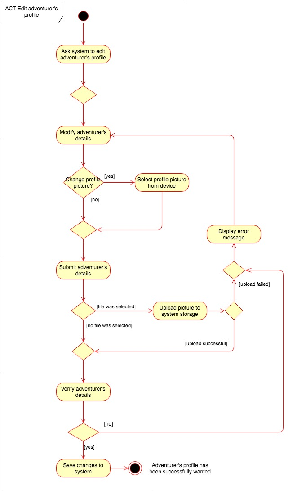
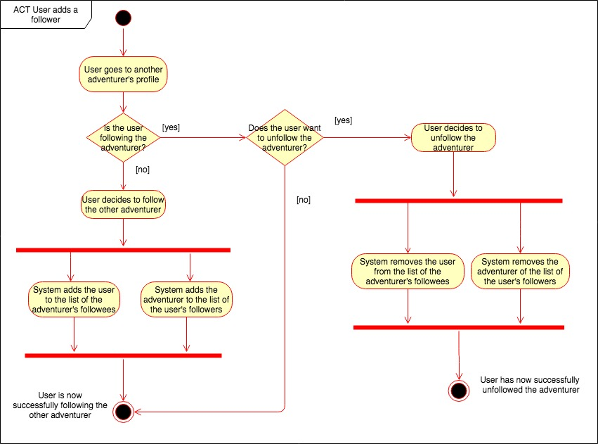
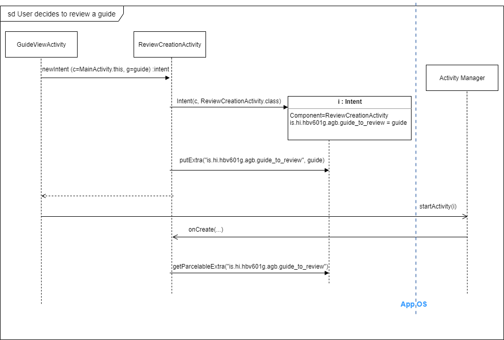
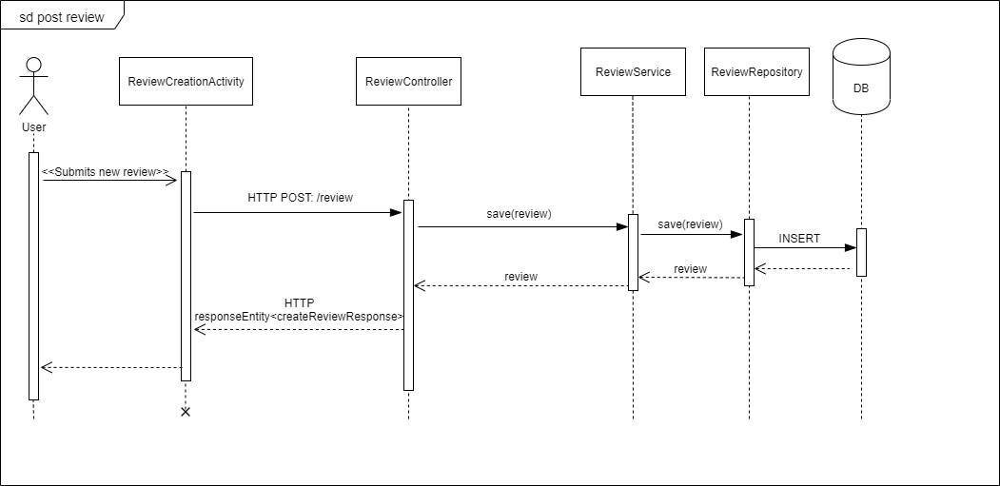
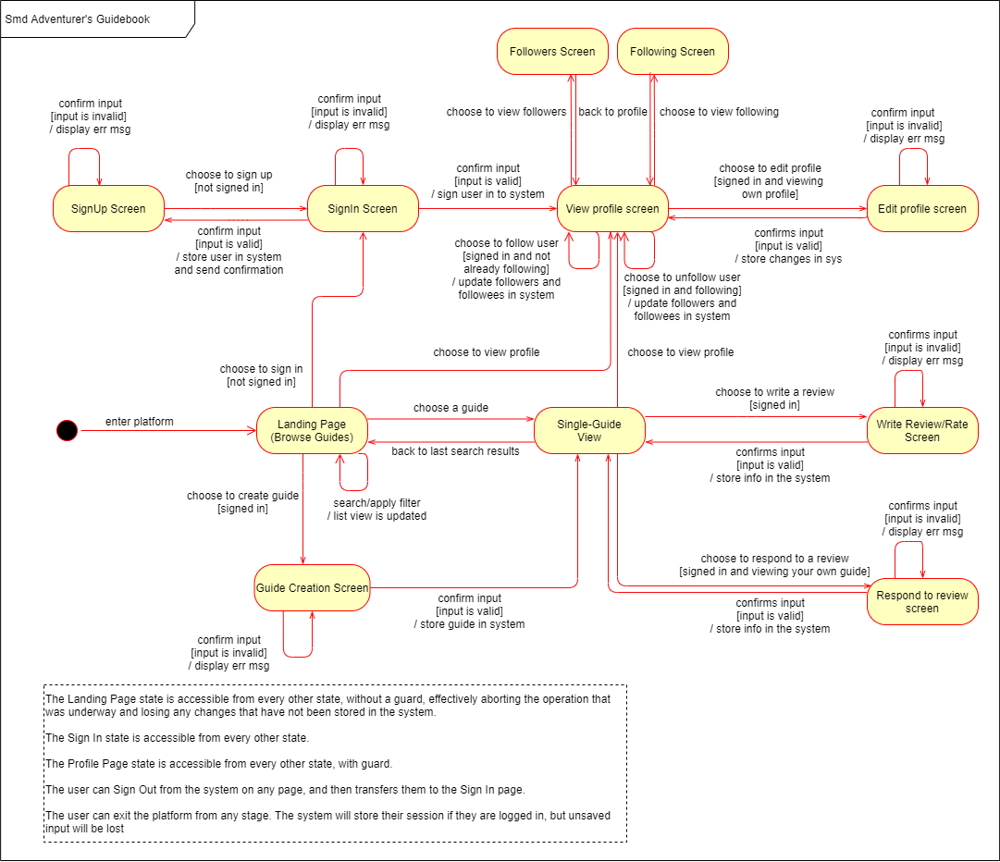
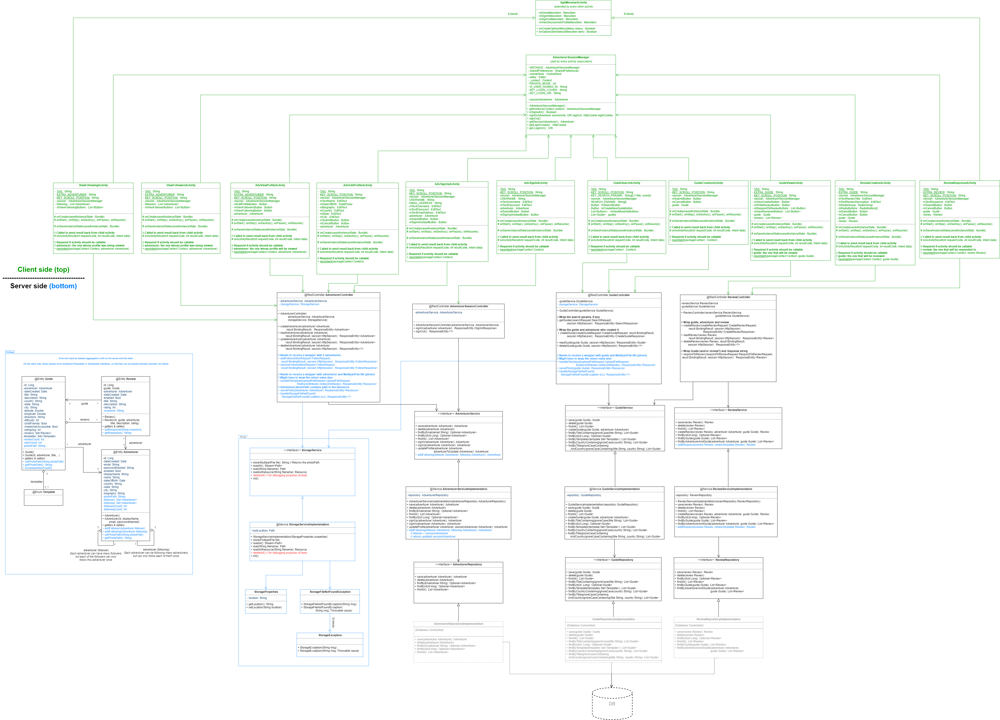

# HBV601G

## Assignment 2 - Design Model

### Team 13

- Andrea Rakel Sigurðardóttir, ars59@hi.is
- Bjartur Örn Jónsson, boj8@hi.is
- Erling Óskar Kristjánsson, eok4@hi.is
- Þórarinn Árnason

 

 

 

 

 

 

#### Class Diagram

